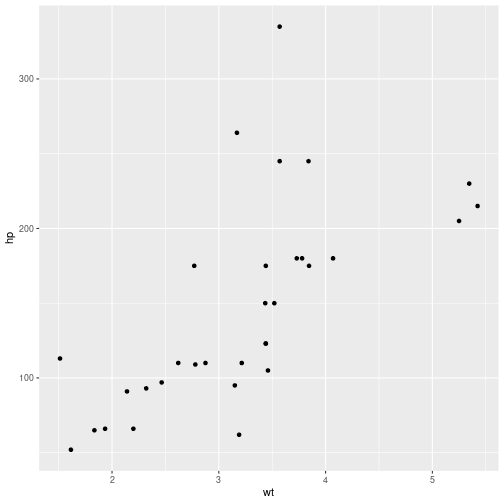

# Introduction

Welcome to this manuscript starter!

To write a new manuscript, clone the repo and rename the `manuscript-starter` directory to your preferred project/manuscript name.

The root of the starter includes a number of files:

  - Makefile

  - lib/

The lib directory contains templates and auxilliary files for different outputs.

## Dependencies

The repo requires a LaTeX installation, an R installation, pandoc and associated filter (citeproc, crossref, citeproc-preamble) and some fonts.


## The Makefile

The Makefile is the most important file in the repo. It contains some hardcoded directories and filenames that you may want to change. This goes for e.g. the bibliography stuff, which are two filenames. BIB is the name of the bibtex database to get citation info, and the CSL is the CSL style file.

The Makefile has multiple targets. Typically you'd use `html` or `pdf` to typeset.


## Lorem ipsum

Lorem ipsum.Lorem ipsum dolor sit amet, consectetur adipiscing elit. Nunc vitae est est. Curabitur imperdiet dolor in arcu scelerisque dapibus. Integer consequat magna ut tristique imperdiet. Sed quis massa dapibus nisi congue scelerisque fringilla sit amet ipsum. Quisque varius neque vel malesuada suscipit. Curabitur id lectus vitae libero semper rhoncus id eget nunc. Fusce interdum lacinia risus sed condimentum. Vestibulum eu felis eu erat imperdiet vulputate. Duis vel accumsan lacus. [@lyngstad_changes_2013; @lyngstad_siblings_2010; @lyngstad_pooling_2010]

Nullam sem velit, egestas semper leo eu, eleifend varius dolor. Pellentesque dapibus, dui a posuere gravida, orci massa pulvinar urna, eu sodales lacus massa in lectus. Fusce sit amet turpis imperdiet felis elementum ornare eu a sem. Fusce malesuada nec odio quis vehicula. Nullam tincidunt tempor sem ac congue. Aliquam erat volutpat. Etiam nec fringilla est. Nullam eget est fringilla, fermentum justo eu, porttitor metus. Sed nec massa aliquam, tempor diam in, varius libero. Vestibulum faucibus quam vitae ante porttitor facilisis. Morbi hendrerit consequat nibh vitae tristique.

Curabitur varius tincidunt efficitur. Maecenas lobortis velit ante, eu ultricies nisl elementum id. Cras tincidunt tortor risus, a sagittis tortor cursus lobortis. Cras lacus tortor, bibendum ut scelerisque nec, viverra eget massa. Donec ornare faucibus bibendum. Fusce ullamcorper sem sapien, eget lobortis dolor aliquet quis. Ut mattis enim at molestie iaculis. Pellentesque iaculis enim quis ipsum placerat aliquet.


```r
library(tidyverse)
```

```
## ── Attaching packages ─────────────────────────────────────── tidyverse 1.3.0 ──
```

```
## ✔ ggplot2 3.3.2     ✔ purrr   0.3.4
## ✔ tibble  3.0.4     ✔ dplyr   1.0.2
## ✔ tidyr   1.1.2     ✔ stringr 1.4.0
## ✔ readr   1.4.0     ✔ forcats 0.5.0
```

```
## ── Conflicts ────────────────────────────────────────── tidyverse_conflicts() ──
## ✖ dplyr::filter() masks stats::filter()
## ✖ dplyr::lag()    masks stats::lag()
```

```r
library(arsenal)
tableby(mtcars)
```

```
## Error: $ operator is invalid for atomic vectors
```

Suspendisse ac tempus sem. Sed ut lacus sit amet massa scelerisque tempor. Vestibulum in odio porttitor, dapibus turpis sodales, tempor metus. Vivamus finibus fermentum lacus, at eleifend nunc rutrum ac. Mauris ultricies turpis arcu, vel aliquam mi maximus a. Suspendisse consequat velit pharetra, dignissim magna non, facilisis velit. Vivamus mattis maximus tincidunt. Lorem ipsum dolor sit amet, consectetur adipiscing elit. Donec vestibulum ullamcorper ipsum id dictum. Quisque libero metus, semper ut lorem ultricies, dignissim sagittis justo. Pellentesque quis tellus tortor. Curabitur leo metus, malesuada in nisl a, interdum lobortis turpis.

## A subsection with figure

Nulla convallis orci massa, accumsan ultrices nulla volutpat eu. Morbi tincidunt lorem quis rutrum finibus. Suspendisse potenti. Maecenas nunc sem, aliquam et elementum in, auctor sed turpis. Donec purus felis, egestas quis erat ut, tristique posuere mi. Morbi volutpat est quis est porttitor bibendum. In sit amet ipsum ullamcorper, elementum purus quis, molestie ante. Aenean vel imperdiet enim. Duis non hendrerit ante. Pellentesque id nisl sollicitudin, mattis mauris finibus, suscipit nisi. Aenean ut iaculis tellus. Lorem ipsum dolor sit amet, consectetur adipiscing elit. Curabitur porttitor augue dolor, convallis suscipit libero fermentum vitae.


```r
ggplot(mtcars, aes(x=wt, y=hp))+ geom_point()
```



### A subsubsection

Even more text here. Nulla convallis orci massa, accumsan ultrices nulla volutpat eu. Morbi tincidunt lorem quis rutrum finibus. Suspendisse potenti. Maecenas nunc sem, aliquam et elementum in, auctor sed turpis. Donec purus felis, egestas quis erat ut, tristique posuere mi. Morbi volutpat est quis est porttitor bibendum. In sit amet ipsum ullamcorper, elementum purus quis, molestie ante. Aenean vel imperdiet enim. Duis non hendrerit ante. Pellentesque id nisl sollicitudin, mattis mauris finibus, suscipit nisi. Aenean ut iaculis tellus. Lorem ipsum dolor sit amet, consectetur adipiscing elit. Curabitur porttitor augue dolor, convallis suscipit libero fermentum vitae.

After here, one would expect some references.
