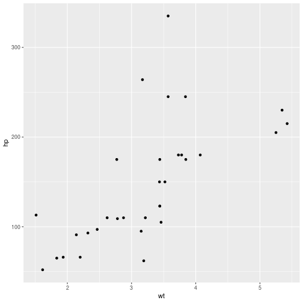

# Introduction

Lorem ipsum.Lorem ipsum dolor sit amet, consectetur adipiscing elit. Nunc vitae est est. Curabitur imperdiet dolor in arcu scelerisque dapibus. Integer consequat magna ut tristique imperdiet. Sed quis massa dapibus nisi congue scelerisque fringilla sit amet ipsum. Quisque varius neque vel malesuada suscipit. Curabitur id lectus vitae libero semper rhoncus id eget nunc. Fusce interdum lacinia risus sed condimentum. Vestibulum eu felis eu erat imperdiet vulputate. Duis vel accumsan lacus.

Nullam sem velit, egestas semper leo eu, eleifend varius dolor. Pellentesque dapibus, dui a posuere gravida, orci massa pulvinar urna, eu sodales lacus massa in lectus. Fusce sit amet turpis imperdiet felis elementum ornare eu a sem. Fusce malesuada nec odio quis vehicula. Nullam tincidunt tempor sem ac congue. Aliquam erat volutpat. Etiam nec fringilla est. Nullam eget est fringilla, fermentum justo eu, porttitor metus. Sed nec massa aliquam, tempor diam in, varius libero. Vestibulum faucibus quam vitae ante porttitor facilisis. Morbi hendrerit consequat nibh vitae tristique.

Curabitur varius tincidunt efficitur. Maecenas lobortis velit ante, eu ultricies nisl elementum id. Cras tincidunt tortor risus, a sagittis tortor cursus lobortis. Cras lacus tortor, bibendum ut scelerisque nec, viverra eget massa. Donec ornare faucibus bibendum. Fusce ullamcorper sem sapien, eget lobortis dolor aliquet quis. Ut mattis enim at molestie iaculis. Pellentesque iaculis enim quis ipsum placerat aliquet.


```r
library(tidyverse)
```

```
## ── Attaching packages ────────────────────────────────── tidyverse 1.2.1.9000 ──
```

```
## ✔ ggplot2 3.2.1     ✔ purrr   0.3.3
## ✔ tibble  2.1.3     ✔ dplyr   0.8.3
## ✔ tidyr   1.0.0     ✔ stringr 1.4.0
## ✔ readr   1.3.1     ✔ forcats 0.4.0
```

```
## ── Conflicts ────────────────────────────────────────── tidyverse_conflicts() ──
## ✖ dplyr::filter() masks stats::filter()
## ✖ dplyr::lag()    masks stats::lag()
```

```r
summary(mtcars)
```

```
##       mpg             cyl             disp             hp       
##  Min.   :10.40   Min.   :4.000   Min.   : 71.1   Min.   : 52.0  
##  1st Qu.:15.43   1st Qu.:4.000   1st Qu.:120.8   1st Qu.: 96.5  
##  Median :19.20   Median :6.000   Median :196.3   Median :123.0  
##  Mean   :20.09   Mean   :6.188   Mean   :230.7   Mean   :146.7  
##  3rd Qu.:22.80   3rd Qu.:8.000   3rd Qu.:326.0   3rd Qu.:180.0  
##  Max.   :33.90   Max.   :8.000   Max.   :472.0   Max.   :335.0  
##       drat             wt             qsec             vs        
##  Min.   :2.760   Min.   :1.513   Min.   :14.50   Min.   :0.0000  
##  1st Qu.:3.080   1st Qu.:2.581   1st Qu.:16.89   1st Qu.:0.0000  
##  Median :3.695   Median :3.325   Median :17.71   Median :0.0000  
##  Mean   :3.597   Mean   :3.217   Mean   :17.85   Mean   :0.4375  
##  3rd Qu.:3.920   3rd Qu.:3.610   3rd Qu.:18.90   3rd Qu.:1.0000  
##  Max.   :4.930   Max.   :5.424   Max.   :22.90   Max.   :1.0000  
##        am              gear            carb      
##  Min.   :0.0000   Min.   :3.000   Min.   :1.000  
##  1st Qu.:0.0000   1st Qu.:3.000   1st Qu.:2.000  
##  Median :0.0000   Median :4.000   Median :2.000  
##  Mean   :0.4062   Mean   :3.688   Mean   :2.812  
##  3rd Qu.:1.0000   3rd Qu.:4.000   3rd Qu.:4.000  
##  Max.   :1.0000   Max.   :5.000   Max.   :8.000
```

Some more text here.
Suspendisse ac tempus sem. Sed ut lacus sit amet massa scelerisque tempor. Vestibulum in odio porttitor, dapibus turpis sodales, tempor metus. Vivamus finibus fermentum lacus, at eleifend nunc rutrum ac. Mauris ultricies turpis arcu, vel aliquam mi maximus a. Suspendisse consequat velit pharetra, dignissim magna non, facilisis velit. Vivamus mattis maximus tincidunt. Lorem ipsum dolor sit amet, consectetur adipiscing elit. Donec vestibulum ullamcorper ipsum id dictum. Quisque libero metus, semper ut lorem ultricies, dignissim sagittis justo. Pellentesque quis tellus tortor. Curabitur leo metus, malesuada in nisl a, interdum lobortis turpis.

Nulla convallis orci massa, accumsan ultrices nulla volutpat eu. Morbi tincidunt lorem quis rutrum finibus. Suspendisse potenti. Maecenas nunc sem, aliquam et elementum in, auctor sed turpis. Donec purus felis, egestas quis erat ut, tristique posuere mi. Morbi volutpat est quis est porttitor bibendum. In sit amet ipsum ullamcorper, elementum purus quis, molestie ante. Aenean vel imperdiet enim. Duis non hendrerit ante. Pellentesque id nisl sollicitudin, mattis mauris finibus, suscipit nisi. Aenean ut iaculis tellus. Lorem ipsum dolor sit amet, consectetur adipiscing elit. Curabitur porttitor augue dolor, convallis suscipit libero fermentum vitae.


```r
ggplot(mtcars, aes(x=wt, y=hp))+ geom_point()
```




Even more tesxt here.
